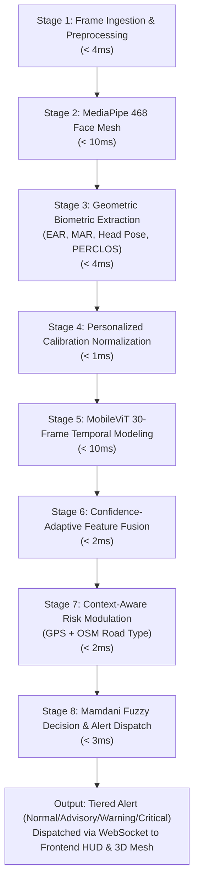

# AlertX — AI Real-Time Driver Drowsiness Detection System
## Comprehensive Master Project Plan & Division of Labor

---

## 1. Executive Summary
**AlertX** is an enterprise-grade, edge-deployable AI driver safety system that continuously monitors driver vigilance, detects yawning, micro-sleeps, and cognitive fatigue, and issues tiered warnings (Normal, Advisory, Warning, Critical) with an end-to-end processing budget under **40ms per frame** (>= 25-30 FPS).

The system integrates:
1. High-speed 468-point 3D facial landmark tracking (MediaPipe).
2. Biometric feature extraction (EAR, MAR, Head Pose Euler Angles, 30-frame PERCLOS).
3. 15-second personalized driver calibration.
4. MobileViT temporal sequence encoding.
5. Confidence-adaptive feature fusion.
6. Context-aware risk modulation (GPS speed + OpenStreetMap road category).
7. Mamdani Fuzzy Inference System for robust decision-making.
8. Low-latency WebSocket streaming & Three.js 3D spatial visualization.

---

## 2. Team Structure & Division of Labor

```
+-----------------------------------------------------------------------------------+
|                                 ALERTX ARCHITECTURE                               |
+-----------------------------------------------------------------------------------+
|                                                                                   |
|  [ PERSON 1: Frontend & 3D UI ]        [ PERSON 2: Backend & Decision Engine ]     |
|  Directory: team1-frontend/            Directory: team2-backend/                  |
|  * Three.js 3D Cockpit & Face Rig     * FastAPI High-Performance Gateway         |
|  * Webcam Ingestion & Canvas Feeder    * Confidence-Adaptive Feature Fusion       |
|  * Real-Time Telemetry HUD             * Context Risk Analyzer (GPS + OSM)        |
|  * Web Audio Synthesized Alarms        * Mamdani Fuzzy Logic Engine               |
|  * Calibration Wizard Modal            * Bidirectional WebSocket Hub              |
|                                                                                   |
|                         [ PERSON 3: CV & AI Modeling ]                            |
|                         Directory: team3-ml-simulation/                           |
|                         * MediaPipe 468 Facial Mesh Pipeline                      |
|                         * Biometrics (EAR, MAR, PERCLOS, Head Pose)               |
|                         * 15-Second Personalized Calibration Module               |
|                         * MobileViT 30-Frame Temporal Sequence Encoder            |
|                         * ML Simulation & Latency Profiling Harness               |
+-----------------------------------------------------------------------------------+
```

### Detailed Roles & Responsibilities

| Role | Domain | Primary Responsibilities | Key Deliverables |
| :--- | :--- | :--- | :--- |
| **Person 1** | Frontend & 3D Visualization | Web client UI/UX, Three.js 3D avatar/face wireframe mount, HTML5 webcam stream capture, real-time gauges/meters, Web Audio alert synthesizer. | `team1-frontend/` (HTML, CSS, Three.js script, Dashboard HUD, WebSocket client) |
| **Person 2** | Backend, Fusion & Decision | High-throughput FastAPI server, Kalman/Confidence-based feature fusion, OSM/GPS context risk engine, Mamdani Fuzzy Inference System, WebSocket stream coordinator. | `team2-backend/` (FastAPI app, `fuzzy_engine.py`, `fusion_engine.py`, `context_analyzer.py`) |
| **Person 3** | Computer Vision & AI Modeling | Real-time facial landmark extraction (468 points), geometric metric calculations (EAR/MAR/PnP Head Pose/PERCLOS), 15s baseline calibration, MobileViT temporal sequence model. | `team3-ml-simulation/` (`mediapipe_extractor.py`, `feature_extractor.py`, `calibration.py`, `temporal_model.py`, `ml_pipeline.py`) |

---

## 3. The 8-Stage Real-Time Pipeline (<40ms SLA)

To guarantee real-time performance at 30 FPS, every frame must pass through all 8 stages within a strict **40ms latency budget**:



### Latency Budget Breakdown:
1. **Stage 1 (Frame Ingestion & Preprocessing)**: HTML5 Video Canvas capture / OpenCV frame resize (640x480) & RGB conversion. **[3 - 4 ms]**
2. **Stage 2 (MediaPipe Landmark Extraction)**: GPU/CPU-accelerated inference extracting 468 3D landmarks + confidence score. **[8 - 10 ms]**
3. **Stage 3 (Biometric Extraction)**:
   - Eye Aspect Ratio (EAR) for both eyes
   - Mouth Aspect Ratio (MAR) for yawn aperture
   - SolvePnP for Head Pose (Pitch = nodding, Yaw = distraction, Roll = tilting)
   - 30-frame rolling PERCLOS buffer update. **[3 - 4 ms]**
4. **Stage 4 (Personalized Calibration Normalization)**: Baseline adjustment against initial 15-second driver calibration (offsets for natural eye shape/squint). **[0.5 - 1 ms]**
5. **Stage 5 (MobileViT Temporal Encoding)**: 30-frame sequence window encoding micro-sleep duration & head nod velocity. **[8 - 10 ms]**
6. **Stage 6 (Confidence-Adaptive Feature Fusion)**: Dynamically weighting EAR vs. MAR vs. Head Pose based on landmark tracking confidence & occlusion. **[1 - 2 ms]**
7. **Stage 7 (Context-Aware Risk Assessment)**: Speed (km/h) multiplier & Road Type (Highway vs. Urban vs. Rural) severity scaling. **[1 - 2 ms]**
8. **Stage 8 (Mamdani Fuzzy Logic & Alert Dispatch)**: Membership evaluation, fuzzy rule matrix, centroid defuzzification, WebSocket JSON broadcast. **[2 - 3 ms]**

**Total End-to-End Latency Target: ~30 - 36 ms (Well below the 40ms SLA).**

---

## 4. Alert Severity Classification Tiers

| Severity Level | Fatigue Index (0-100) | Trigger Conditions | In-Cabin Action / System Response |
| :--- | :--- | :--- | :--- |
| **Normal** | 0 – 25 | EAR >= Baseline, PERCLOS < 10%, Head stable, MAR normal | Green HUD status, 3D face neutral, no audio |
| **Advisory** | 26 – 50 | Isolated yawn (MAR > 0.65), slight PERCLOS elevation (10-25%), or minor head drift | Yellow HUD status, ambient dash glow, soft chime advisory |
| **Warning** | 51 – 75 | Repeated yawns, PERCLOS (25-40%), prolonged eye closure (1.0-1.8s), noticeable head nod | Orange HUD warning, pulsing indicator, urgent dual-tone acoustic alert |
| **Critical** | 76 – 100 | Eye closure > 2.0s, PERCLOS > 40%, severe downward head drop (Pitch < -20 deg) at high speed | Red flashing cockpit HUD, continuous high-decibel alarm, haptic trigger signal |

---

## 5. Integration Roadmap & Milestones

```mermaid
gantt
    title AlertX Multi-Team Sprint Roadmap
    dateFormat  YYYY-MM-DD
    section Phase 1: Foundations
    Repository Scaffolding & API Contract       :done, p1, 2026-10-01, 3d
    Mock WebSocket Server & Sim Client          :done, p2, 2026-10-04, 3d
    section Phase 2: Core Engineering
    Team 3: MediaPipe & Biometrics Pipeline     :active, p3, 2026-10-07, 7d
    Team 2: Fuzzy Logic & Fusion Engines        :active, p4, 2026-10-07, 7d
    Team 1: Three.js Rig & Dashboard Layout     :active, p5, 2026-10-07, 7d
    section Phase 3: Advanced Intelligence
    Team 3: MobileViT Temporal Sequence Model   :p6, 2026-10-14, 6d
    Team 2: Context Modulator (OSM + GPS)       :p7, 2026-10-14, 4d
    Team 1: Web Audio Synthesizer & Video Feeder:p8, 2026-10-16, 4d
    section Phase 4: Integration & Optimization
    End-to-End WebSocket Pipeline Assembly      :p9, 2026-10-20, 5d
    Sub-40ms Latency Benchmarking & Profiling   :p10, 2026-10-25, 4d
    Docker Multi-Container Deployment           :p11, 2026-10-29, 3d
```

---

## 6. Repository File Tree
```
alertx/
├── API_CONTRACT.md
├── PROJECT_PLAN.md
├── README.md
├── .gitignore
├── docker-compose.yml
│
├── team1-frontend/                  # Person 1: Frontend & 3D Visualization
│   ├── index.html                   # Master Cockpit HUD Interface
│   ├── package.json                 # Frontend dependencies (Vite / Dev server)
│   ├── README.md                    # Setup & Three.js Mount Documentation
│   ├── styles/
│   │   └── main.css                 # Glassmorphism dark-cockpit styling & alert animations
│   └── scripts/
│       ├── main.js                  # Application orchestrator
│       ├── three_visualizer.js      # Three.js 3D Scene, lighting, camera & avatar mount
│       ├── webcam_manager.js        # HTML5 camera stream & frame sampler
│       ├── dashboard.js             # Telemetry HUD meters, charts & alert badges
│       ├── websocket_client.js      # Resilient WebSocket client & message router
│       └── audio_alert.js           # Web Audio API procedural alarm synthesizer
│
├── team2-backend/                   # Person 2: Backend, Fusion & Decision Engine
│   ├── requirements.txt             # FastAPI, Uvicorn, scikit-fuzzy, Pydantic, etc.
│   ├── config.py                    # Server configuration & threshold constants
│   ├── models.py                    # Pydantic data schemas matching API_CONTRACT.md
│   ├── main.py                      # FastAPI app entry point & REST/WebSocket routes
│   ├── fusion_engine.py             # Confidence-adaptive feature fusion module
│   ├── context_analyzer.py          # GPS speed & OpenStreetMap road risk modulator
│   ├── fuzzy_engine.py              # Mamdani Fuzzy Inference System (Alert Classifier)
│   ├── websocket_manager.py         # Real-time WebSocket connection & broadcast manager
│   └── tests/
│       └── test_fuzzy_and_fusion.py # Unit tests for fuzzy engine & fusion logic
│
└── team3-ml-simulation/             # Person 3: Computer Vision & AI Modeling
    ├── requirements.txt             # MediaPipe, OpenCV, PyTorch, NumPy, SciPy
    ├── config.yaml                  # ML landmark indices & biometric thresholds
    ├── mediapipe_extractor.py       # 468-point Facial Mesh extractor
    ├── feature_extractor.py         # EAR, MAR, Head Pose (SolvePnP), PERCLOS (30f)
    ├── calibration.py               # 15-second personalized driver calibration engine
    ├── temporal_model.py            # MobileViT 30-frame temporal sequence encoder
    ├── ml_pipeline.py               # Full CV/ML pipeline controller (<40ms)
    ├── simulator.py                 # Synthetic/video stream simulation harness
    └── tests/
        └── test_cv_pipeline.py      # Benchmark & validation unit tests
```

